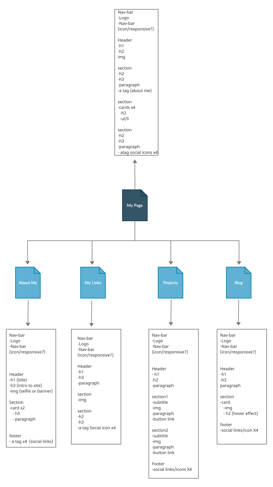
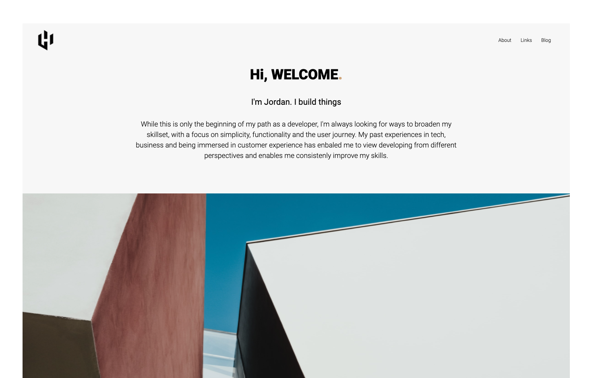
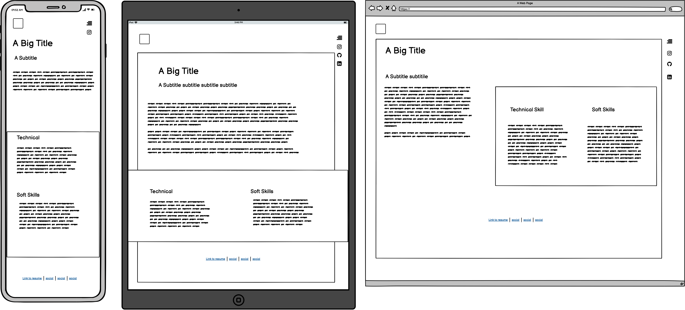
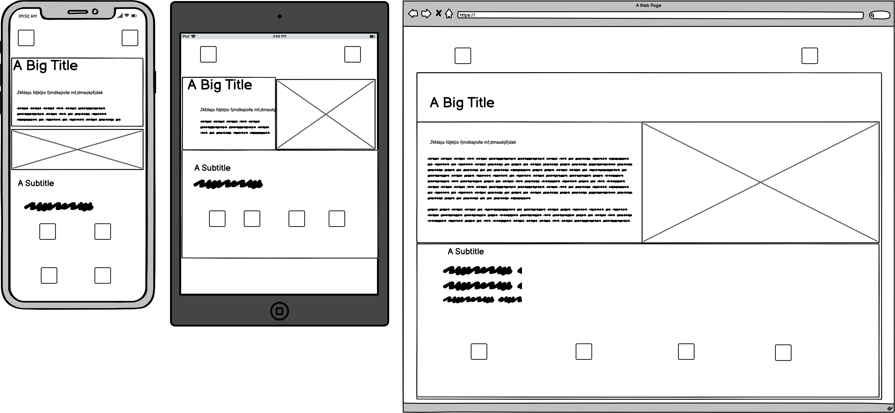
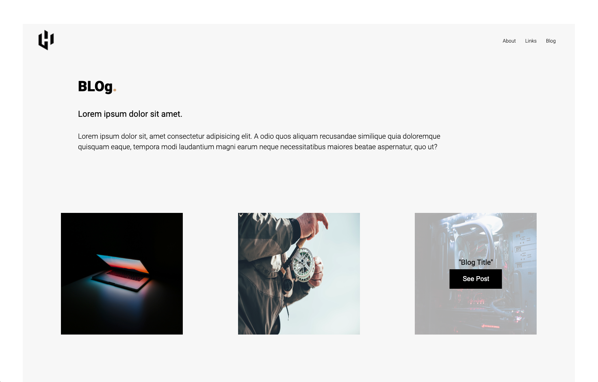

  

<h3 align="center">Project Title</h3>

---

 Few lines describing your project.
      

## 📝 Table of Contents

- [Purpose](#Purpose)
- [Link](#Link)
- [Purpose](#Purpose)
- [Features](#Features)
- [SiteMaps](#SiteMaps)
- [Screenshots](#Screenshots)
- [Target](#Target)
- [TechStack](#TechStack)

##  Purpose 

The Purpose...

##  Link 

https://www.google.com

## Features 

##  SiteMaps 

##  Screenshots 

## Target 

## TechStack 

