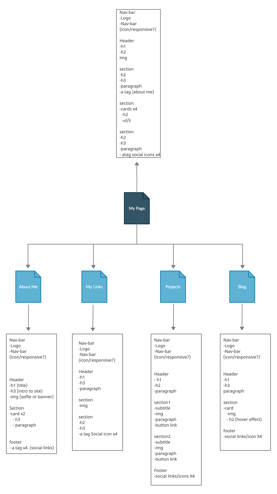
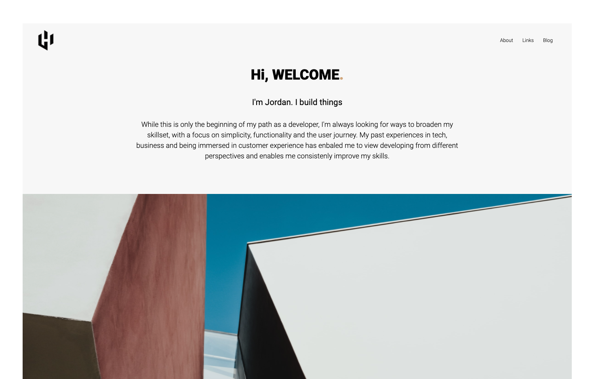
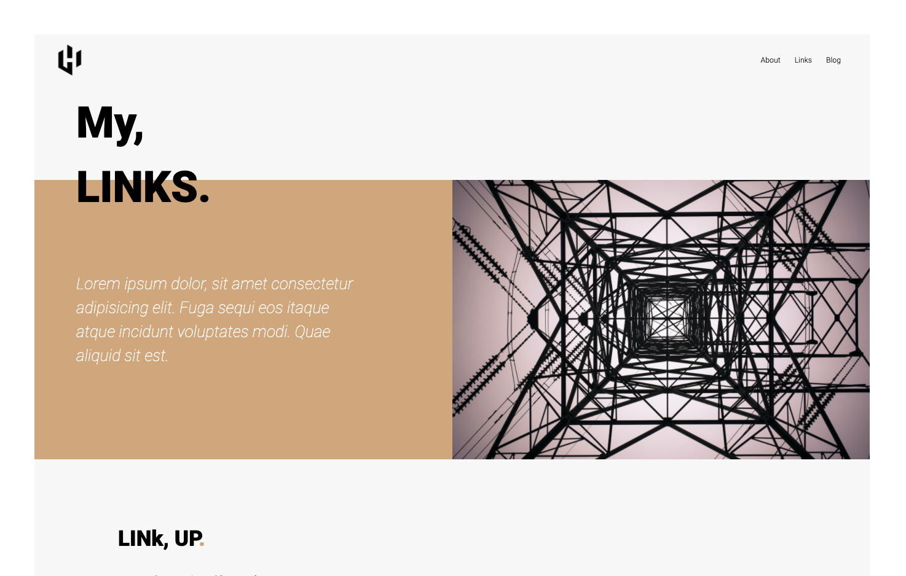
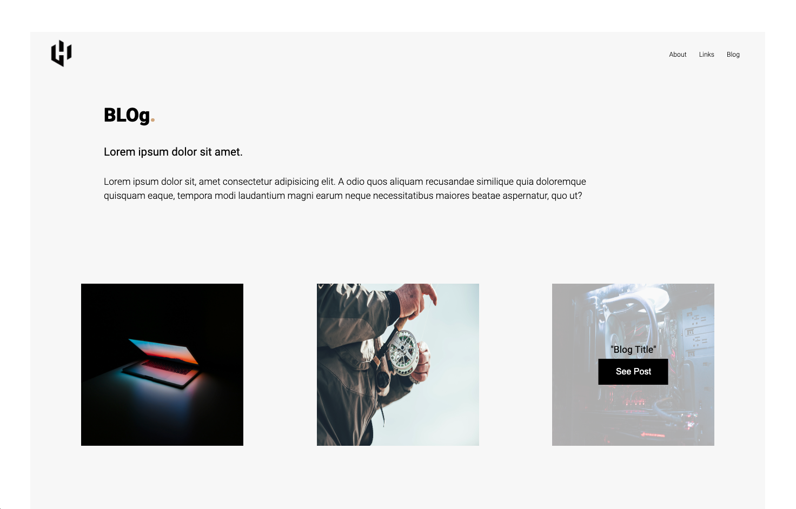

# Portfolio Website

## Table of Contents

- [Link](#link)
- [About](#about)
- [Features](#features)
- [SiteMap](#sitemap)
- [Target Audience](#target_audience)
- [Screenshots](#screenshots)
- [Tech Stack](#tech_stack)


## Link <a name="link"></a>

https://jordanshardy.github.io/JordanHardy_T1A2/

## About <a name = "about"></a>

```
The purpose of this project is to create a base website as a portfolio for future work, upskilling and a landing page to showcase myself and my skills as a developer. 
```
## Features <a name = "features"></a>

The site focuses on simplicity and minimal styling while still grabbing the viewers attention. The idea is to keep the site minimal with effecient use of white space and text, titles and containers/sections for styling.

Each page has a different layout but still sticks to an overall theme and color pallete. The layout of each page showcases my interest in design and enables me to scale the site/pages as my skillset broadens.

Functionality is important with display responsivness for mobile and desktop view. To do this I have utilized CSS Grid and Flexbox for divs, containers, sections, articles and text/headings.

Other features include hover changes on logos, links, images and icons to send the viewer to my social sites or to download my CV.

### Sitemap <a name="sitemap"></a>



### Target Audience <a name="target_audience"></a>

The target audience is anyone wanting to know more about me. This could be anyone seeing me on social media that is interested in seeing more of my work, or a potential employer who would like to see my skillset, github and other information relating to employement.

## Screenshots <a name = "screenshots"></a>






## Tech Stack <a name="tech_stack"></a>

HTML
CSS